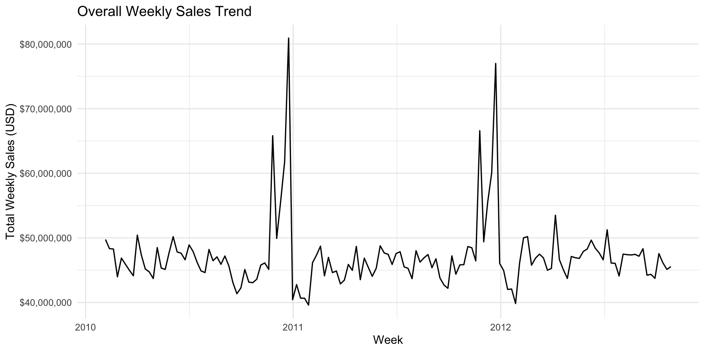
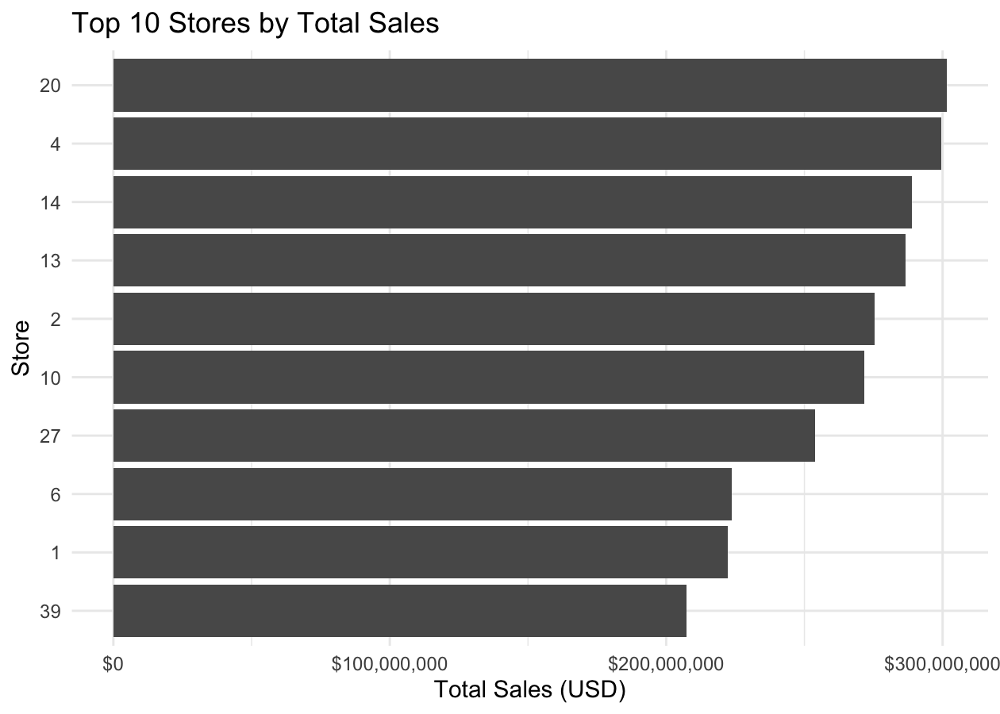
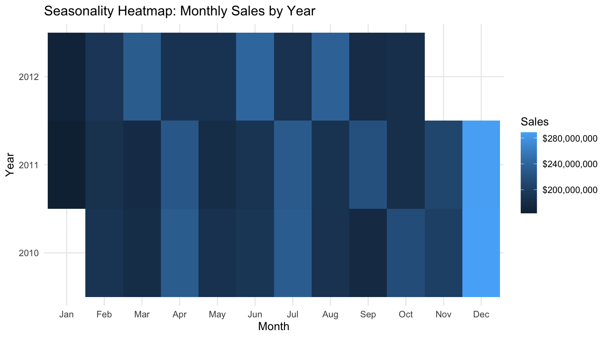

```{r setup, include=FALSE}
knitr::opts_chunk$set(echo = FALSE, message = FALSE, warning = FALSE, fig.retina = 2)
library(readr); library(dplyr); library(knitr)
```

**Overview**

This repository contains an end-to-end workflow for analyzing U.S. retail weekly sales and producing short-term forecasts (ARIMA baseline; Prophet optional).
For the full narrative, see the HTML report in report/ or the GitHub Pages link.

*Live report (GitHub Pages)*: https://vcheque.github.io/Sales-Analytics-Forecasting/
*Raw HTML in repo*: report/sales_analysis_report.html

**Quick KPIs**

```{r}
if (file.exists("outputs/tables/kpis.csv")) {
  kpis <- read_csv("outputs/tables/kpis.csv", show_col_types = FALSE)
  kable(kpis)
} else {
  cat("KPIs not found yet. Run scripts/02_eda_visuals.R to generate outputs/tables/kpis.csv.")
}
```


**Highlights**

*Overall Weekly Sales Trend*

```{r}
if (file.exists("outputs/figures/01_overall_weekly_sales_trend.png")) {
  
}
```


*Top 10 Stores by Total Sales*

```{r}
if (file.exists("outputs/figures/02_top10_stores_total_sales.png")) {
  
}
```


*Seasonality Heatmap*

```{r}
if (file.exists("outputs/figures/03_seasonality_heatmap_month_year.png")) {
  
}

```

*Backtesting (tsCV) snapshot*

```{r backtest-readme-avg, echo=FALSE, message=FALSE, warning=FALSE}
path_avg <- "outputs/tables/backtest_metrics_avg.csv"
if (file.exists(path_avg)) {
  bt_avg <- readr::read_csv(path_avg, show_col_types = FALSE)
  knitr::kable(bt_avg, caption = "Rolling-origin CV — average metrics across evaluated stores")
} else {
  cat("Backtest summary not found. Run scripts/03b_backtesting.R.")
}
```

```{r}
path_hz <- "outputs/tables/backtest_metrics_by_horizon.csv"
if (file.exists(path_hz)) {
  bt_hz <- readr::read_csv(path_hz, show_col_types = FALSE)
  library(ggplot2)
  ggplot(bt_hz, aes(horizon, RMSE, group = store)) +
    geom_line(alpha = 0.25) +
    stat_summary(fun = mean, geom = "line", linewidth = 1) +
    labs(title = "RMSE by Forecast Horizon (1..12 weeks)",
         x = "Horizon (weeks ahead)", y = "RMSE") +
    theme_minimal(base_size = 12)
} else {
  cat("Backtest horizon file not found. Run scripts/03b_backtesting.R.")
}
```


**How to Reproduce**

    scripts/01_data_cleaning.R → creates data/processed/*
    
    scripts/02_eda_visuals.R → saves figures/tables to outputs/*
    
    scripts/03_forecasting.R → saves forecast plots + metrics
    
    Shiny: shiny::runApp("app")
    
    Report: knit report/sales_analysis_report.Rmd

**Environment**

Reproducibility managed by renv. Run renv::restore() to install packages.


