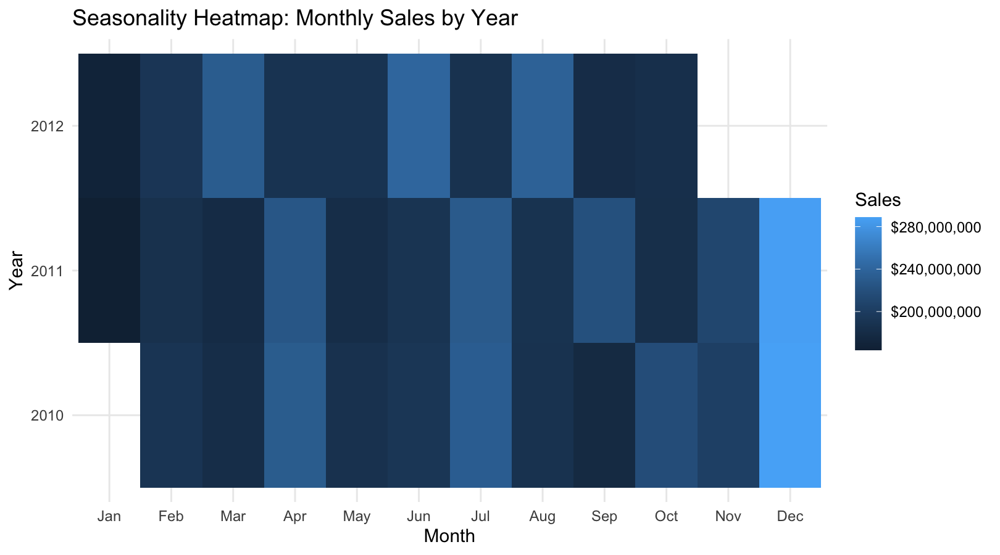

U.S. Retail Sales Analytics & Forecasting
================

- [2) Render to GitHub-ready
  Markdown](#2-render-to-github-ready-markdown)

**Overview**

This repository contains an end-to-end workflow for analyzing U.S.
retail weekly sales and producing short-term forecasts (ARIMA baseline;
Prophet optional). For the full narrative, see the HTML report in
report/ or the GitHub Pages link.

*Live report (GitHub Pages)*:
<https://vcheque.github.io/Sales-Analytics-Forecasting/> *Raw HTML in
repo*: report/sales_analysis_report.html

**Quick KPIs**

| min_date   | max_date   | n_stores | n_depts | total_sales |
|:-----------|:-----------|---------:|--------:|------------:|
| 2010-02-05 | 2012-10-26 |       45 |      81 |  6737218987 |

**Highlights**

*Overall Weekly Sales Trend*

<!-- -->

*Top 10 Stores by Total Sales*

<!-- -->

*Seasonality Heatmap*

<!-- -->

**How to Reproduce**

    scripts/01_data_cleaning.R → creates data/processed/*

    scripts/02_eda_visuals.R → saves figures/tables to outputs/*

    scripts/03_forecasting.R → saves forecast plots + metrics

    Shiny: shiny::runApp("app")

    Report: knit report/sales_analysis_report.Rmd

**Environment**

Reproducibility managed by renv. Run renv::restore() to install
packages.

> Notes  
> Keep **heavy computations out** of `README.Rmd`. You’re including
> already-saved images/tables, so knitting is instantaneous.  
> This gives you a polished README **without** duplicating the long HTML
> report.

## 2) Render to GitHub-ready Markdown

From your project root in R:

\`\`\`r if (!“rmarkdown” %in% rownames(installed.packages()))
install.packages(“rmarkdown”) rmarkdown::render(“README.Rmd”,
output_format = “github_document”, output_file = “README.md”)
